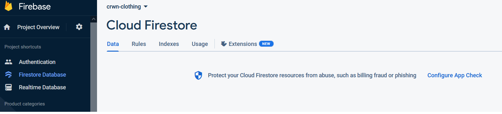
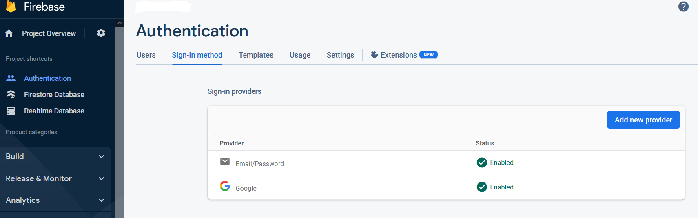

## GUITAR SHOP 

This is a simple application made with React. It uses Firebase/Firestore database to store data.
You can register with email and password or log in with your Google account. After log in you can
add or remove products to your cart as well as see details for chosen product. There is a predifined
admin account which can add/delete items to/from database. Please be careful when using it.
This project is under development and constant addition of new functionalities, but it is fully operational.

To run the project download it open in some IDE (I preffer VSCode) and run "npm install" then "npm start" in terminal.
You have to have NPM installed on your system as well as Firebase Project with Firestore Database created (it is simple and free to create one) and Firebase Authentication with Email/Password and Google sign-in methods enabled.
All you have to do next is to navigate to /src/utils/firebase/firebase.utils.js and replace the values ​​from line 29 to line 34 with your own found in the section "Project Settings" in your Firebase Project.

