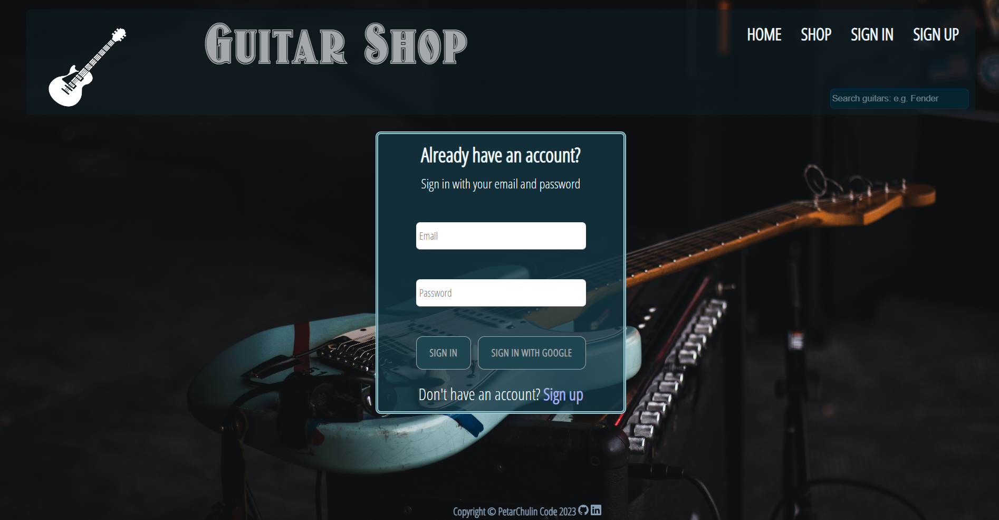
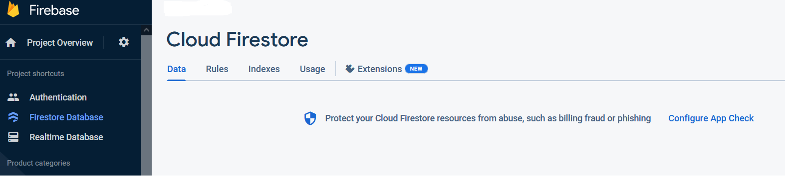

## GUITAR SHOP 

- <a href="#description">Description</a>
- <a href="#run-app">Run the project</a>
- <a href="#tech">Tech</a>
- <a href="#screens">Screenshots</a>

# 
Description

This is a simple demo app made with React. It uses Firebase/Firestore database to manage data.
The purpose of the application is to demonstrate the very basic functionalities of an e-shop using CRUD operations.
You have to register with email and password or log in with your Google account. After log in you can
add or remove products to your cart as well as see details for chosen product. There is a predifined
admin account which can add/delete items to/from database. If you want to try admin access please 
contact me to provide it. /petercbg@abv.bg/This project is under development and constant addition
of new functionalities, but it is fully operational.

# 
Run the project

You can access the project on: https://guitars-shop.web.app
                    or
download repository from "<>Code" button open it in some IDE (I prefer and recommend VSCode) and run "npm install" then "npm start" in the terminal and the app will start on 'http://localhost:3000'.  You must have NPM installed on your system and Firebase Project with Firestore Database created (it is simple and free to create one). You need also Firebase Authentication with Email/Password and Google sign-in methods enabled.
All you have to do next is to navigate to /src/utils/firebase/firebase.utils.js and replace 
the values ​​from line 29 to line 34 with your own found in the section "Project Settings" in your Firebase Project.

# 
Tech

- <a href="https://react.dev/">React</a>
- <a href="https://reactrouter.com/">React Router</a>
- <a href="https://firebase.google.com/">Firebase</a>
- <a href="https://sweetalert2.github.io/">Sweetalert 2</a>
- <a href="https://firebase.google.com/docs/firestore">Firebase Firestore</a>
- <a href="https://firebase.google.com/docs/auth">Firebase Authentication</a>

# 
Screenshots

